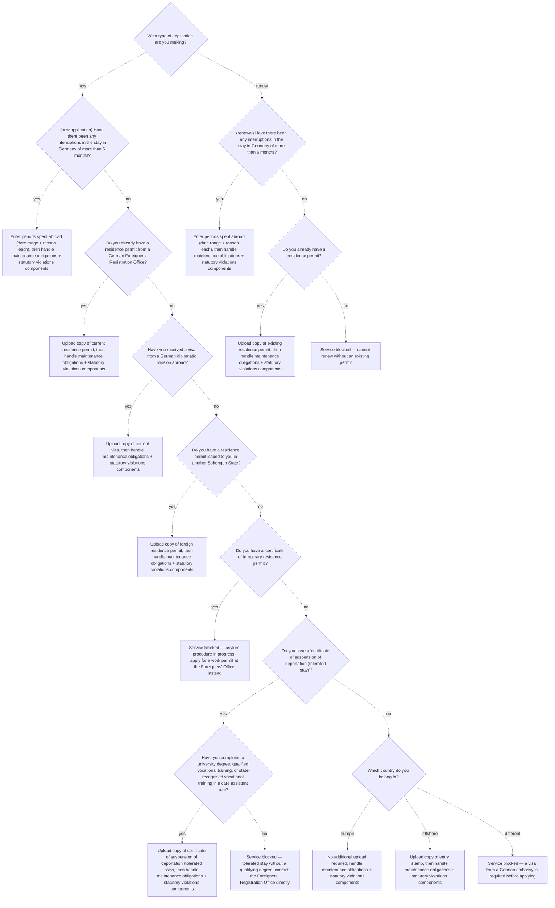

# at-erw

Erwerbstätigkeit — extend or newly apply for a residence permit for the purpose of gainful employment.

**Edge coverage:** 0/23 (0%) — solid arrow = covered, dashed = not covered

## Branch gaps

- `application_type` (0/2 covered): missing new, renew
- `interruptions_new` (0/2 covered): missing yes, no
- `has_residence_permit` (0/2 covered): missing yes, no
- `has_diplomatic_visa` (0/2 covered): missing yes, no
- `has_schengen_permit` (0/2 covered): missing yes, no
- `has_temp_residence` (0/2 covered): missing yes, no
- `has_suspension` (0/2 covered): missing yes, no
- `has_vocational_qualification` (0/2 covered): missing yes, no
- `country_group` (0/3 covered): missing europe, offshore, different
- `interruptions_renew` (0/2 covered): missing yes, no
- `has_existing_permit` (0/2 covered): missing yes, no
