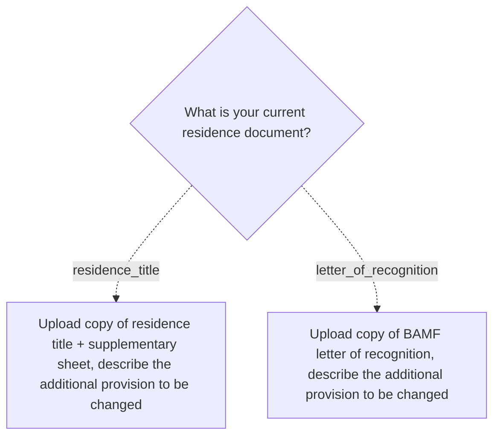

# at-neb

Nebenbestimmungen — request a change to a condition (Nebenbestimmung) on an existing residence document.

**Edge coverage:** 0/2 (0%) — solid arrow = covered, dashed = not covered

## Branch gaps

- `residence_document` (0/2 covered): missing residence_title, letter_of_recognition
