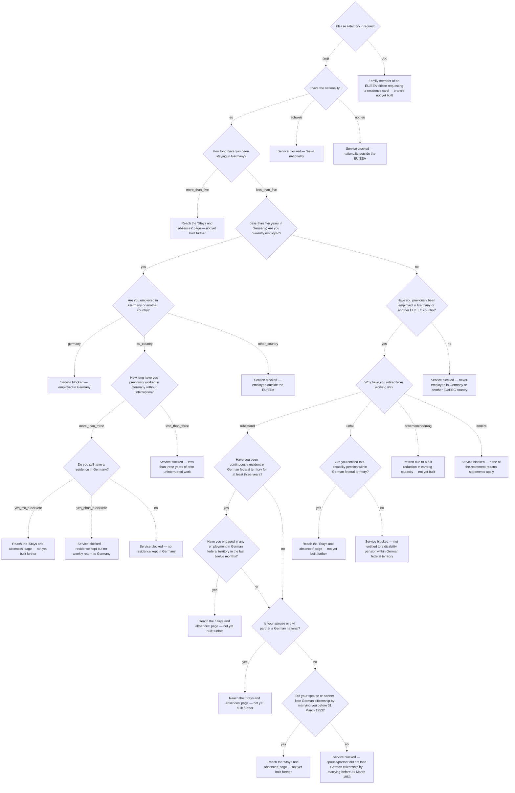

# aw-auf

Aufenthaltskarte — residence card for EU/EEA citizens and their family members (persons entitled to freedom of movement).

**Edge coverage:** 0/33 (0%) — solid arrow = covered, dashed = not covered

## Branch gaps

- `application_type` (0/2 covered): missing DAB, AK
- `nationality_group` (0/3 covered): missing eu, schweiz, not_eu
- `stay_duration` (0/2 covered): missing more_than_five, less_than_five
- `currently_employed` (0/2 covered): missing yes, no
- `previously_employed` (0/2 covered): missing yes, no
- `retirement_reason` (0/4 covered): missing ruhestand, unfall, erwerbsminderung, andere
- `disability_pension` (0/2 covered): missing yes, no
- `resident_three_years` (0/2 covered): missing yes, no
- `employed_last_12_months` (0/2 covered): missing yes, no
- `spouse_is_german_national` (0/2 covered): missing yes, no
- `spouse_lost_german_citizenship` (0/2 covered): missing yes, no
- `employment_location` (0/3 covered): missing germany, eu_country, other_country
- `prior_work_duration` (0/2 covered): missing more_than_three, less_than_three
- `residence_in_germany` (0/3 covered): missing yes_mit_rueckkehr, yes_ohne_rueckkehr, no
