# aw-auf

Aufenthaltskarte — residence card for EU/EEA citizens and their family members (persons entitled to freedom of movement).

**Edge coverage:** 0/71 (0%) — solid arrow = covered, dashed = not covered

```mermaid
flowchart TD
    application_type{"Please select your request"}
    nationality_group{"I have the nationality..."}
    blocked_switzerland["Service blocked — Swiss nationality"]
    blocked_non_eu_eea["Service blocked — nationality outside the EU/EEA"]
    stay_duration{"How long have you been staying in Germany?"}
    currently_employed{"(less than five years in Germany) Are you currently employed?"}
    previously_employed{"Have you previously been employed in Germany or another EU/EEC country?"}
    blocked_never_employed["Service blocked — never employed in Germany or another EU/EEC country"]
    retirement_reason{"Why have you retired from working life?"}
    disability_pension{"Are you entitled to a disability pension within German federal territory?"}
    blocked_no_disability_pension["Service blocked — not entitled to a disability pension within German federal territory"]
    stays_and_absences_via_disability_pension["Continues into the shared flow (acting person onward - same for both request types)"]
    resident_two_years{"Have you been continuously resident in German federal territory for at least two years?"}
    stays_and_absences_via_two_years["Continues into the shared flow (acting person onward - same for both request types)"]
    blocked_no_retirement_reason_applies["Service blocked — none of the retirement-reason statements apply"]
    resident_three_years{"Have you been continuously resident in German federal territory for at least three years?"}
    employed_last_12_months{"Have you engaged in any employment in German federal territory in the last twelve months?"}
    spouse_is_german_national{"Is your spouse or civil partner a German national?"}
    spouse_lost_german_citizenship{"Did your spouse or partner lose German citizenship by marrying you before 31 March 1953?"}
    blocked_spouse_citizenship["Service blocked — spouse/partner did not lose German citizenship by marrying before 31 March 1953"]
    employment_location{"Are you employed in Germany or another country?"}
    blocked_employed_germany["Service blocked — employed in Germany"]
    blocked_employed_other_country["Service blocked — employed outside the EU/EEA"]
    prior_work_duration{"How long have you previously worked in Germany without interruption?"}
    blocked_short_prior_work["Service blocked — less than three years of prior uninterrupted work"]
    residence_in_germany{"Do you still have a residence in Germany?"}
    blocked_residence_no_weekly_return["Service blocked — residence kept but no weekly return to Germany"]
    blocked_no_residence["Service blocked — no residence kept in Germany"]
    stays_and_absences_via_five_years["Continues into the shared flow (acting person onward - same for both request types)"]
    stays_and_absences_via_residence["Continues into the shared flow (acting person onward - same for both request types)"]
    stays_and_absences_via_recent_employment["Continues into the shared flow (acting person onward - same for both request types)"]
    stays_and_absences_via_german_spouse["Continues into the shared flow (acting person onward - same for both request types)"]
    stays_and_absences_via_former_german_spouse["Continues into the shared flow (acting person onward - same for both request types)"]
    holds_residence_card{"Do you already hold a residence card from a German Foreigners Registration Office?"}
    holds_residence_card_no_not_built["Not yet built"]
    message_about{"What is your message about?"}
    message_about_ehe_not_built["Marriage/civil partnership dissolved — not yet built"]
    message_about_fortzug_not_built["Reference person moved away from Germany — not yet built"]
    message_about_tod_not_built["Reference person died — not yet built"]
    message_about_rechts_not_built["Reference person obtained permanent right of residence 5 years ago — not yet built"]
    residence_permit_five_years{"Have you been in possession of a residence permit for five years?"}
    residence_permit_five_years_no_not_built["Not yet built"]
    resided_five_years_with_reference_person{"Have you continuously resided in Germany with your reference person for five years?"}
    stays_and_absences_via_five_year_permit["Continues into the shared flow (acting person onward - same for both request types)"]
    continue_staying_with_reference_person{"Would you like to continue to stay with a reference person in Germany who is entitled to freedom of movement?"}
    blocked_no_continue_staying["Service blocked — doesn't want to continue staying with reference person"]
    reference_person_citizenship{"What is the citizenship of your reference person?"}
    blocked_reference_person_other_country["Service blocked — reference person has a different nationality (incl. Switzerland)"]
    reference_person_employed_or_looking{"Is your reference person employed or looking for work?"}
    reference_person_employed_or_looking_no_not_built["Not yet built"]
    rueckkehrerfaelle{"Your reference person is a German citizen — do any of the following statements apply?"}
    blocked_rueckkehrerfaelle_none["Service blocked — none of the statements apply"]
    family_relationship{"What is your family relationship with the reference person?"}
    blocked_family_relationship_other["Service blocked — none of the family relationship statements apply"]
    wants_shared_dwelling{"Do you intend to live permanently with your reference person in a shared dwelling?"}
    close_family_relationship{"(doesn't want to live in a shared dwelling) Do you still have a close family relationship with the reference person?"}
    blocked_no_close_family_relationship["Service blocked — no close family relationship with reference person"]
    early_permanent_residence{"Has your reference person been in Germany for less than five years, and do they already have a permanent right of residence?"}
    stays_and_absences_via_reference_person["Continues into the shared flow (acting person onward - same for both request types)"]
    application_type -.->|"DAB"| nationality_group
    application_type -.->|"AK"| holds_residence_card
    nationality_group -.->|"eu"| stay_duration
    nationality_group -.->|"schweiz"| blocked_switzerland
    nationality_group -.->|"not_eu"| blocked_non_eu_eea
    stay_duration -.->|"more_than_five"| stays_and_absences_via_five_years
    stay_duration -.->|"less_than_five"| currently_employed
    currently_employed -.->|"yes"| employment_location
    currently_employed -.->|"no"| previously_employed
    previously_employed -.->|"yes"| retirement_reason
    previously_employed -.->|"no"| blocked_never_employed
    retirement_reason -.->|"ruhestand"| resident_three_years
    retirement_reason -.->|"unfall"| disability_pension
    retirement_reason -.->|"erwerbsminderung"| resident_two_years
    retirement_reason -.->|"andere"| blocked_no_retirement_reason_applies
    disability_pension -.->|"yes"| stays_and_absences_via_disability_pension
    disability_pension -.->|"no"| blocked_no_disability_pension
    resident_two_years -.->|"yes"| stays_and_absences_via_two_years
    resident_two_years -.->|"no"| spouse_is_german_national
    resident_three_years -.->|"yes"| employed_last_12_months
    resident_three_years -.->|"no"| spouse_is_german_national
    employed_last_12_months -.->|"yes"| stays_and_absences_via_recent_employment
    employed_last_12_months -.->|"no"| spouse_is_german_national
    spouse_is_german_national -.->|"yes"| stays_and_absences_via_german_spouse
    spouse_is_german_national -.->|"no"| spouse_lost_german_citizenship
    spouse_lost_german_citizenship -.->|"yes"| stays_and_absences_via_former_german_spouse
    spouse_lost_german_citizenship -.->|"no"| blocked_spouse_citizenship
    employment_location -.->|"germany"| blocked_employed_germany
    employment_location -.->|"eu_country"| prior_work_duration
    employment_location -.->|"other_country"| blocked_employed_other_country
    prior_work_duration -.->|"more_than_three"| residence_in_germany
    prior_work_duration -.->|"less_than_three"| blocked_short_prior_work
    residence_in_germany -.->|"yes_mit_rueckkehr"| stays_and_absences_via_residence
    residence_in_germany -.->|"yes_ohne_rueckkehr"| blocked_residence_no_weekly_return
    residence_in_germany -.->|"no"| blocked_no_residence
    holds_residence_card -.->|"yes"| message_about
    holds_residence_card -.->|"no"| holds_residence_card_no_not_built
    message_about -.->|"neue_ak_oder_dak"| residence_permit_five_years
    message_about -.->|"ehe_lebenspartnerschaft"| message_about_ehe_not_built
    message_about -.->|"fortzug_der_bezugsperson"| message_about_fortzug_not_built
    message_about -.->|"tod_der_bezugsperson"| message_about_tod_not_built
    message_about -.->|"rechts_bezugsperson"| message_about_rechts_not_built
    residence_permit_five_years -.->|"yes"| resided_five_years_with_reference_person
    residence_permit_five_years -.->|"no"| residence_permit_five_years_no_not_built
    resided_five_years_with_reference_person -.->|"yes"| stays_and_absences_via_five_year_permit
    resided_five_years_with_reference_person -.->|"no"| continue_staying_with_reference_person
    continue_staying_with_reference_person -.->|"yes"| reference_person_citizenship
    continue_staying_with_reference_person -.->|"no"| blocked_no_continue_staying
    reference_person_citizenship -.->|"eu"| reference_person_employed_or_looking
    reference_person_citizenship -.->|"dtl"| rueckkehrerfaelle
    reference_person_citizenship -.->|"ehe_lebenspartner_eu"| reference_person_employed_or_looking
    reference_person_citizenship -.->|"andere"| blocked_reference_person_other_country
    reference_person_employed_or_looking -.->|"yes"| family_relationship
    reference_person_employed_or_looking -.->|"no"| reference_person_employed_or_looking_no_not_built
    rueckkehrerfaelle -.->|"gemeinsamer_aufenthalt_eu"| family_relationship
    rueckkehrerfaelle -.->|"erwerb_de_bezugsperson"| family_relationship
    rueckkehrerfaelle -.->|"deutsches_minderjaehriges_kind"| family_relationship
    rueckkehrerfaelle -.->|"keine"| blocked_rueckkehrerfaelle_none
    family_relationship -.->|"ehe"| wants_shared_dwelling
    family_relationship -.->|"kind_unter_21"| wants_shared_dwelling
    family_relationship -.->|"kind_ueber_21"| wants_shared_dwelling
    family_relationship -.->|"fa_mit_unterhalt"| wants_shared_dwelling
    family_relationship -.->|"fa_ohne_unterhalt"| wants_shared_dwelling
    family_relationship -.->|"andere"| blocked_family_relationship_other
    wants_shared_dwelling -.->|"yes"| early_permanent_residence
    wants_shared_dwelling -.->|"no"| close_family_relationship
    close_family_relationship -.->|"yes"| early_permanent_residence
    close_family_relationship -.->|"no"| blocked_no_close_family_relationship
    early_permanent_residence -.->|"yes"| stays_and_absences_via_reference_person
    early_permanent_residence -.->|"no"| stays_and_absences_via_reference_person
    early_permanent_residence -.->|"unknown"| stays_and_absences_via_reference_person
```

## Branch gaps

- `application_type` (0/2 covered): missing DAB, AK
- `nationality_group` (0/3 covered): missing eu, schweiz, not_eu
- `stay_duration` (0/2 covered): missing more_than_five, less_than_five
- `currently_employed` (0/2 covered): missing yes, no
- `previously_employed` (0/2 covered): missing yes, no
- `retirement_reason` (0/4 covered): missing ruhestand, unfall, erwerbsminderung, andere
- `disability_pension` (0/2 covered): missing yes, no
- `resident_two_years` (0/2 covered): missing yes, no
- `resident_three_years` (0/2 covered): missing yes, no
- `employed_last_12_months` (0/2 covered): missing yes, no
- `spouse_is_german_national` (0/2 covered): missing yes, no
- `spouse_lost_german_citizenship` (0/2 covered): missing yes, no
- `employment_location` (0/3 covered): missing germany, eu_country, other_country
- `prior_work_duration` (0/2 covered): missing more_than_three, less_than_three
- `residence_in_germany` (0/3 covered): missing yes_mit_rueckkehr, yes_ohne_rueckkehr, no
- `holds_residence_card` (0/2 covered): missing yes, no
- `message_about` (0/5 covered): missing neue_ak_oder_dak, ehe_lebenspartnerschaft, fortzug_der_bezugsperson, tod_der_bezugsperson, rechts_bezugsperson
- `residence_permit_five_years` (0/2 covered): missing yes, no
- `resided_five_years_with_reference_person` (0/2 covered): missing yes, no
- `continue_staying_with_reference_person` (0/2 covered): missing yes, no
- `reference_person_citizenship` (0/4 covered): missing eu, dtl, ehe_lebenspartner_eu, andere
- `reference_person_employed_or_looking` (0/2 covered): missing yes, no
- `rueckkehrerfaelle` (0/4 covered): missing gemeinsamer_aufenthalt_eu, erwerb_de_bezugsperson, deutsches_minderjaehriges_kind, keine
- `family_relationship` (0/6 covered): missing ehe, kind_unter_21, kind_ueber_21, fa_mit_unterhalt, fa_ohne_unterhalt, andere
- `wants_shared_dwelling` (0/2 covered): missing yes, no
- `close_family_relationship` (0/2 covered): missing yes, no
- `early_permanent_residence` (0/3 covered): missing yes, no, unknown
